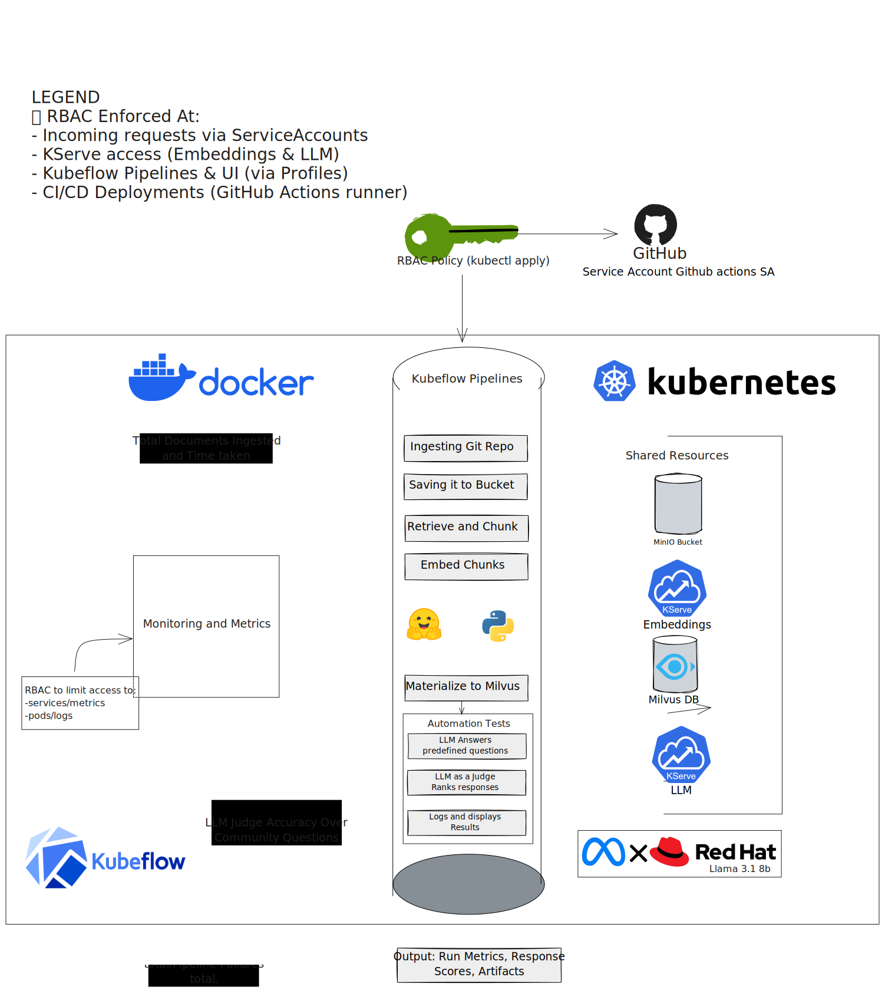
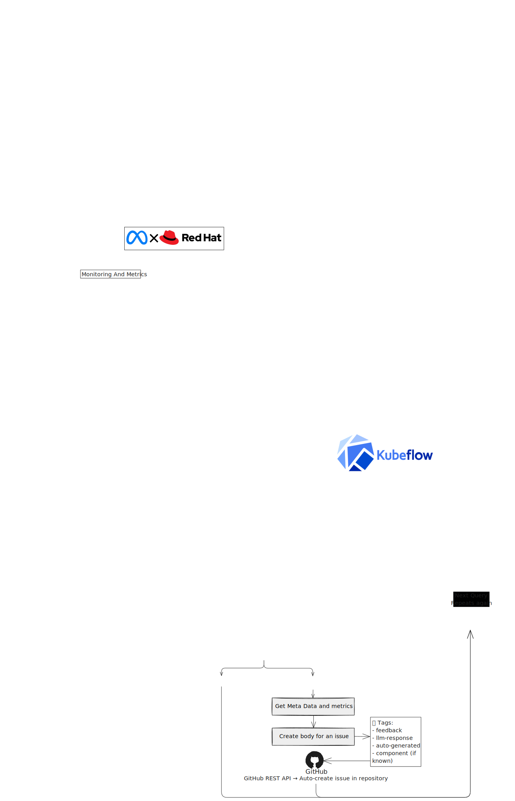

# Kubeflow Documentation AI Assistant

[](https://github.com/kubeflow/community/issues/867)

## Overview

The **Kubeflow docs-agent** is an official LLM-powered documentation assistant designed explicitly for the Kubeflow ecosystem.

**The Problem:** Kubeflow users often struggle to find relevant information across extensive, scattered documentation spanning different services, components, and repositories. Traditional keyword search lacks context and often returns irrelevant results, making onboarding, configuration, and troubleshooting difficult.

**The Solution:** This project provides an intelligent, chat-based documentation assistant. Using **Retrieval-Augmented Generation (RAG)**, the agent understands the semantic intent behind users' queries, retrieves the most relevant documentation chunks, and generates accurate, context-aware answers using a Large Language Model (Llama 3.1-8B). This ensures rapid, accurate support tailored to the user's specific questions.

### Key Features
- 🔍 **Intelligent Search**: Semantic search across Kubeflow documentation.
- 🤖 **AI-Powered Responses**: Contextual answers using the Llama 3.1-8B model.
- ⚡ **Real-time Streaming**: WebSocket and HTTP streaming support for fast responses.
- 🔧 **Tool Calling**: Automatic documentation lookup when needed.
- 📊 **Vector Database**: Integration with Milvus for efficient similarity search.
- 🚀 **Kubernetes Native**: Built for cloud-native deployment and scalability.
- 🔄 **Automated ETL**: Kubeflow Pipelines for data fetching and processing.

---

## Architecture

The system follows a standard Retrieval-Augmented Generation (RAG) pattern, separated into data ingestion and query execution flows.




### High-Level Components
1. **Document Ingestion**: The system fetches raw documentation pages directly from the Kubeflow GitHub repositories (supporting both Markdown and HTML flows) through a Kubeflow Pipeline.
2. **Chunking & Embeddings**: Once downloaded, the text is cleaned and split into manageable chunks with configurable overlap. Each chunk is then converted into a dense vector embedding using `sentence-transformers`.
3. **Vector Storage**: The generated embeddings and their associated metadata (like source URLs) are stored in **Milvus**, a high-performance vector database optimized for rapid similarity search.
4. **Retrieval**: When a user submits a question, the query is embedded using the same model. The API server then queries Milvus to retrieve the semantically similar documentation chunks most relevant to the question.
5. **LLM Response Generation**: The retrieved chunks are structured into a prompt. This prompt is submitted to the LLM (served via KServe with vLLM), which generates a natural-language response complete with citations referring to the original documentation.

---

## Repository Structure

Understanding the repository layout is crucial for navigating the codebase and contributing:

- **`server/`** - Contains the WebSocket API server implementation for real-time chat applications.
- **`server-https/`** - Contains the HTTPS API server (FastAPI) implementation supporting RESTful integrations and web apps.
- **`pipelines/`** - Kubeflow Pipelines code for the ETL process (fetching docs, chunking, embedding, and storing vectors).
- **`manifests/`** - Kubernetes manifests (YAMLs) for deploying backend components like KServe inference services.
- **`docs_scripts/`** - Utility scripts for downloading, parsing, and processing raw documentation files.
- **`kagent-feast-mcp/`** - Includes MCP (Model Context Protocol) integration for Feast feature stores usage by the agent.

---

## Getting Started

Follow these step-by-step instructions to set up the project locally.

### Prerequisites
- Python 3.9+
- Kubernetes cluster (1.20+) with GPU nodes (for LLM inference)
- Helm 3.x
- Kubeflow Pipelines installed
- SSL certificate (to secure the HTTPS API)

### Step-by-Step Setup

**1. Install Milvus Vector Database**
Milvus requires a fresh installation in standalone mode to serve vector lookups locally.

```bash
helm repo add milvus https://milvus-io.github.io/milvus-helm/
helm repo update
helm upgrade --install my-release zilliztech/milvus -n docs-agent \
  --set cluster.enabled=false \
  --set standalone.enabled=true \
  --set etcd.replicaCount=1 \
  --set etcd.persistence.enabled=false \
  --set minio.mode=standalone \
  --set minio.replicas=1 \
  --set pulsar.enabled=false \
  --set pulsarv3.enabled=false \
  --set standalone.podAnnotations."sidecar\.istio\.io/inject"="false"
```

**2. Deploy KServe Inference Service**
We deploy Llama 3.1-8B via KServe. Ensure you have your `HF_TOKEN` enabled as a cluster secret for authentication.

```bash
# Deploys HuggingFace Serving Runtime and InferenceService
kubectl apply -f manifests/serving-runtime.yaml
kubectl apply -f manifests/inference-service.yaml
```

**3. Run the Data Pipeline**
Execute the pipeline to ingest, embed, and store Kubeflow documentation into Milvus. Note that you may need to configure RBAC permissions for the pipeline service account to access Milvus.

```bash
python pipelines/kubeflow-pipeline.py
```

**4. Start the API Server**
Run the server of your choice.

```bash
# For WebSocket API (Real-time tracking)
python server/app.py

# For HTTPS API (FastAPI standard interfaces)
python server-https/app.py
```

---

## Usage Examples

### WebSocket API

```javascript
const ws = new WebSocket('wss://your-domain.com:8000');

ws.onmessage = function(event) {
    const data = JSON.parse(event.data);
    switch(data.type) {
        case 'content':
            console.log('Content:', data.content);
            break;
        case 'citations':
            console.log('Citations:', data.citations);
            break;
    }
};

ws.send(JSON.stringify({
    message: "How do I create a Kubeflow pipeline?"
}));
```

### HTTPS API

**Streaming Request (Server-Sent Events)**:

```bash
curl -X POST "https://your-domain.com/chat" \
  -H "Content-Type: application/json" \
  -H "Accept: text/event-stream" \
  -d '{"message": "What is KServe?", "stream": true}'
```

**Non-streaming Request (JSON Response)**:

```bash
curl -X POST "https://your-domain.com/chat" \
  -H "Content-Type: application/json" \
  -d '{"message": "What is KServe?", "stream": false}'
```

---

## Configuration

### Environment Variables

| Variable | Default | Description |
|---|---|---|
| `KSERVE_URL` | `http://llama.docs-agent.svc.cluster.local/openai/v1/chat/completions` | KServe endpoint URL |
| `MODEL` | `llama3.1-8B` | Model name |
| `PORT` | `8000` | API server port |
| `MILVUS_HOST` | `my-release-milvus.docs-agent.svc.cluster.local` | Milvus host |
| `MILVUS_PORT` | `19530` | Milvus port |
| `MILVUS_COLLECTION` | `docs_rag` | Milvus collection name |
| `EMBEDDING_MODEL` | `sentence-transformers/all-mpnet-base-v2` | Embedding model |

### Pipeline Parameters

| Parameter | Default | Description |
|---|---|---|
| `repo_owner` | `kubeflow` | GitHub repository owner |
| `repo_name` | `website` | GitHub repository name |
| `directory_path` | `content/en` | Documentation directory path |
| `chunk_size` | `1000` | Text chunk size for embedding |
| `chunk_overlap` | `100` | Overlap between chunks |
| `base_url` | `https://www.kubeflow.org/docs` | Base URL for citations |

---

## Development Workflow

We welcome contributions from the community, especially from GSoC applicants! Here is the standard workflow to contribute to the Kubeflow docs-agent:

1. **Fork the Repository**: Click the "Fork" button at the top right of this repository to create your own copy on GitHub.
2. **Clone Locally**: Clone your fork to your local machine:

   ```bash
   git clone https://github.com/YOUR_USERNAME/docs-agent.git
   cd docs-agent
   ```

3. **Create a Branch**: Always create a descriptive feature branch for your work:

   ```bash
   git checkout -b feature/your-feature-name
   ```

4. **Run the Project Locally**: Follow the [Getting Started](#getting-started) steps above to test your changes in a local environment.
5. **Commit and Push**: Write clear, concise commit messages. When you're ready, push your branch to your fork:

   ```bash
   git add .
   git commit -m "feat: description of your feature"
   git push origin feature/your-feature-name
   ```

6. **Submit a Pull Request (PR)**: Go to the original repository and click "New Pull Request". Be sure to clearly describe your changes, the problem they solve, and reference any open issues.

For more details, please see our [Contributing Guidelines](CONTRIBUTING.md).

---

## Troubleshooting

### Common Issues

1. **RBAC Errors**: Verify that your Kubeflow Pipeline service account (`kubeflow:default-editor`) has the proper `milvus-access` bindings to reach Milvus endpoints.
2. **SSL Certificate Issues**: Make sure both API backends use valid certificates from trusted authorities to prevent WebSocket drops and HTTP blockades.
3. **GPU Capacity Restrictions**: Double check GPU limit ceilings and ensure HuggingFace tokens are actively populated in your secret environment.
4. **Milvus Connection**: Test connectivity directly inside your cluster nodes via standard Python `connections.connect()`.

### Debug Commands

```bash
# Check Milvus status
kubectl get pods -n docs-agent | grep milvus

# Check KServe status
kubectl get inferenceservice -n docs-agent

# Check API server logs
kubectl logs -f deployment/docs-assistant-api
```

---

## License

This project is licensed under the Apache License 2.0 - see the [LICENSE](LICENSE) file for details.

## Acknowledgments

### Mentors
- [Francisco Javier Arceo](https://www.linkedin.com/in/franciscojavierarceo/) - Project mentor and guidance
- [Chase Christensen](https://www.linkedin.com/in/chase-c-695463162/) - Project mentor and technical support

### Organizations
- [Google Summer of Code (GSoC)](https://summerofcode.withgoogle.com/) for providing this incredible opportunity
- [Red Hat AI](https://www.redhat.com/en/topics/ai) for providing the Llama 3.1-8B model
- [Hugging Face](https://huggingface.co/) for the model hosting and sentence transformers library
- [Oracle Cloud Infrastructure (OCI)](https://www.oracle.com/cloud/) for providing cloud resources and infrastructure

### Open Source Community
- [Kubeflow Community](https://github.com/kubeflow/community) for the KEP-867 proposal
- [Milvus](https://milvus.io/) for the vector database
- [KServe](https://kserve.github.io/website/) for model serving
- [vLLM](https://github.com/vllm-project/vllm) for high-performance LLM inference