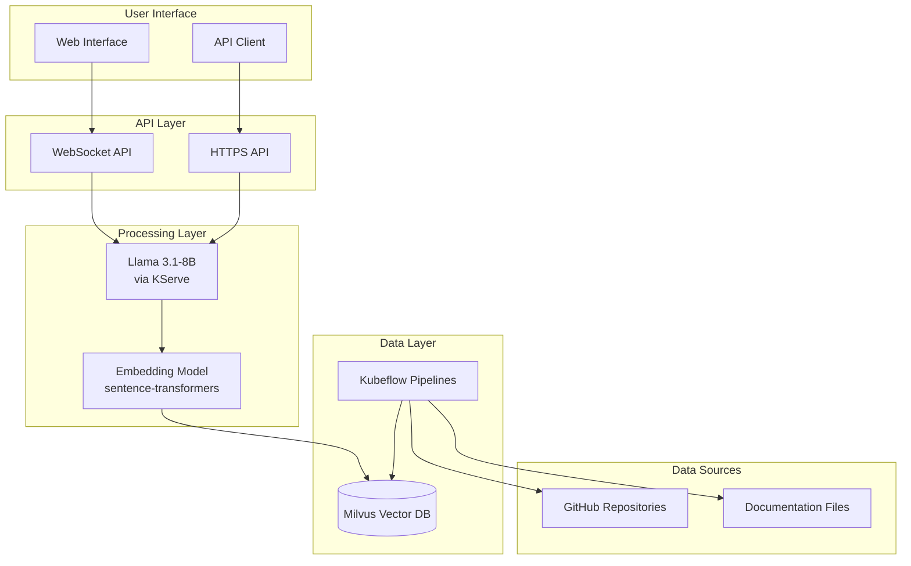
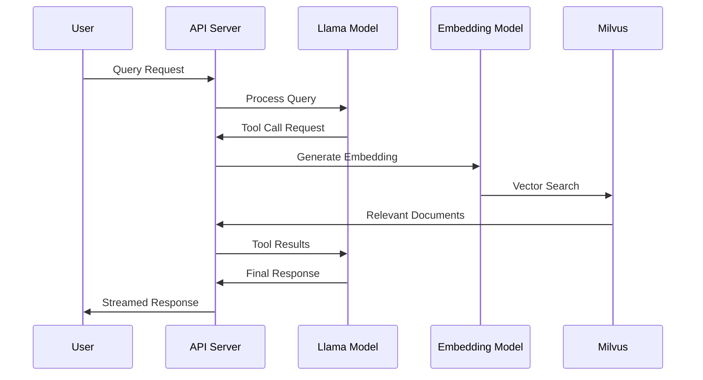

# Kubeflow Documentation AI Assistant

[](https://github.com/kubeflow/community/issues/867)

The official LLM implementation of the Kubeflow Documentation Assistant powered by Retrieval-Augmented Generation (RAG). This repository provides a comprehensive solution for Kubeflow users to search across documentation and get accurate, contextual answers to their queries.

## Table of Contents

- [Overview](#overview)
- [Architecture](#architecture)
- [Prerequisites](#prerequisites)
- [Installation](#installation)
  - [Milvus Vector Database](#milvus-vector-database)
  - [KServe Inference Service](#kserve-inference-service)
  - [Kubeflow Pipelines](#kubeflow-pipelines)
  - [API Server](#api-server)
- [Usage](#usage)
- [Configuration](#configuration)
- [Troubleshooting](#troubleshooting)
- [Contributing](#contributing)

## Overview

### Why This Project Exists

Kubeflow users often struggle to find relevant information across the extensive documentation scattered across different services, components, and repositories. The traditional search approach lacks context and often returns irrelevant results. This documentation assistant addresses these challenges by:

- **Semantic Search**: Understanding the intent behind queries rather than just keyword matching
- **Contextual Responses**: Providing answers based on the most relevant documentation chunks
- **Real-time Processing**: Enabling instant responses through streaming APIs
- **Scalable Architecture**: Leveraging Kubernetes for automatic scaling and resource management

### Key Features

- 🔍 **Intelligent Search**: Semantic search across Kubeflow documentation
- 🤖 **AI-Powered Responses**: Contextual answers using Llama 3.1-8B model
- ⚡ **Real-time Streaming**: WebSocket and HTTP streaming support
- 🔧 **Tool Calling**: Automatic documentation lookup when needed
- 📊 **Vector Database**: Milvus for efficient similarity search
- 🚀 **Kubernetes Native**: Built for cloud-native environments
- 🔄 **Automated ETL**: Kubeflow Pipelines for data processing

## Architecture

### High-Level Architecture



### Data Flow



## Prerequisites

- Kubernetes cluster (1.20+)
- Helm 3.x
- Kubeflow Pipelines
- GPU nodes (for LLM inference)
- SSL certificate (for HTTPS API)

## Installation

### Milvus Vector Database

#### What is Milvus?

Milvus is an open-source vector database designed for AI applications. It provides:

- **High Performance**: Optimized for vector similarity search
- **Scalability**: Horizontal scaling capabilities
- **Multiple Index Types**: Support for various vector indexing algorithms
- **Cloud Native**: Built for Kubernetes environments
- **Multiple APIs**: REST, gRPC, and Python SDK support

#### Installation Steps

1. **Add Helm Repository**:
   ```bash
   helm repo add milvus https://milvus-io.github.io/milvus-helm/
   helm repo update
   ```

2. **Install Milvus**:
   ```bash
   helm upgrade --install my-release zilliztech/milvus -n santhosh \
     --set cluster.enabled=false \
     --set standalone.enabled=true \
     --set etcd.replicaCount=1 \
     --set etcd.persistence.enabled=false \
     --set minio.mode=standalone \
     --set minio.replicas=1 \
     --set pulsar.enabled=false \
     --set pulsarv3.enabled=false \
     --set standalone.podAnnotations."sidecar\.istio\.io/inject"="false"
   ```

#### Configuration Rationale

- **Standalone Mode**: Single-node deployment for development/testing
- **Single etcd Replica**: Reduced resource usage with `etcd.persistence.enabled=false`
- **Standalone MinIO**: Single MinIO instance for object storage
- **Disabled Pulsar**: Not needed for standalone deployment
- **Istio Sidecar Injection**: Disabled to avoid networking issues

3. **Test Connection**:
   ```python
   from pymilvus import connections
   connections.connect("default", host="my-release-milvus.santhosh.svc.cluster.local", port="19530")
   print("Connected to Milvus successfully!")
   ```

4. **External Access** (if needed for different clusters):
   ```bash
   kubectl expose service my-release-milvus \
     --name milvus-external \
     --type=NodePort \
     --port=19530
   ```

### KServe Inference Service

The LLM inference is handled by KServe with vLLM backend for high-performance serving.

#### Serving Runtime Configuration

```yaml
# manifests/serving-runtime.yaml
apiVersion: serving.kserve.io/v1alpha1
kind: ServingRuntime
metadata:
  name: llm-runtime
  namespace: santhosh
spec:
  supportedModelFormats:
    - name: huggingface
      version: "1"
      autoSelect: true
  containers:
    - name: kserve-container
      image: kserve/huggingfaceserver:latest-gpu
      command: ["python", "-m", "huggingfaceserver"]
      resources:
        requests:
          cpu: "4"
          memory: "16Gi"
          nvidia.com/gpu: "1"
        limits:
          cpu: "6"
          memory: "24Gi"
          nvidia.com/gpu: "1"
```

#### Inference Service Configuration

```yaml
# manifests/inference-service.yaml
apiVersion: serving.kserve.io/v1beta1
kind: InferenceService
metadata:
  name: llama
  namespace: santhosh
spec:
  predictor:
    model:
      modelFormat:
        name: huggingface
        version: "1"
      runtime: llm-runtime
      args:
        - --model_name=llama3.1-8B
        - --model_id=RedHatAI/Llama-3.1-8B-Instruct
        - --backend=vllm
        - --max-model-len=32768
        - --gpu-memory-utilization=0.90
        - --enable-auto-tool-choice
        - --tool-call-parser=llama3_json
        - --enable-tool-call-parser
      env:
        - name: HF_TOKEN
          valueFrom:
            secretKeyRef:
              name: huggingface-secret
              key: token
        - name: CUDA_VISIBLE_DEVICES
          value: "0"
      resources:
        requests:
          cpu: "4"
          memory: "16Gi"
          nvidia.com/gpu: "1"
        limits:
          cpu: "6"
          memory: "24Gi"
          nvidia.com/gpu: "1"
```

#### Key Configuration Points

- **Tool Calling**: Enabled with `--enable-auto-tool-choice` and `--enable-tool-call-parser`
- **Custom Template**: vLLM supports custom templates for different model formats
- **Resource Allocation**: GPU memory utilization set to 90% for optimal performance
- **HuggingFace Token**: Required for accessing the model

**Connection Details**:
```python
KSERVE_URL = os.getenv("KSERVE_URL", "http://llama.santhosh.svc.cluster.local/openai/v1/chat/completions")
MODEL = os.getenv("MODEL", "llama3.1-8B")
```

For more details, refer to [KServe documentation](https://kserve.github.io/website/) and [vLLM documentation](https://docs.vllm.ai/).

### Kubeflow Pipelines

The ETL (Extract, Transform, Load) process is implemented as a Kubeflow Pipeline for automated, scalable data processing.

#### Why Kubeflow Pipelines?

- **Infrastructure Management**: Kubernetes handles all infrastructure automatically
- **Scalability**: Auto-scaling based on workload demands
- **Reproducibility**: Version-controlled pipeline definitions
- **Integration**: Seamless integration with other Kubeflow components
- **CI/CD Ready**: Can be triggered via GitHub Actions or other automation tools

#### Pipeline Components

The pipeline consists of three main phases:

##### 1. Repository Fetching

```python
@dsl.component(
    base_image="python:3.9",
    packages_to_install=["requests", "beautifulsoup4"]
)
def download_github_directory(
    repo_owner: str,
    repo_name: str,
    directory_path: str,
    github_token: str,
    github_data: dsl.Output[dsl.Dataset]
):
    # Fetches documentation files from GitHub repositories
    # Supports .md and .html files
    # Handles authentication and recursive directory traversal
```

##### 2. Text Chunking and Embedding

```python
@dsl.component(
    base_image="pytorch/pytorch:2.3.0-cuda12.1-cudnn8-runtime",
    packages_to_install=["sentence-transformers", "langchain"]
)
def chunk_and_embed(
    github_data: dsl.Input[dsl.Dataset],
    repo_name: str,
    base_url: str,
    chunk_size: int,
    chunk_overlap: int,
    embedded_data: dsl.Output[dsl.Dataset]
):
    # Processes text with aggressive cleaning
    # Creates embeddings using sentence-transformers
    # Handles chunking with configurable overlap
```

##### 3. Vector Database Storage

```python
@dsl.component(
    base_image="python:3.9",
    packages_to_install=["pymilvus", "numpy"]
)
def store_milvus(
    embedded_data: dsl.Input[dsl.Dataset],
    milvus_host: str,
    milvus_port: str,
    collection_name: str
):
    # Creates Milvus collection with proper schema
    # Inserts vectors in batches for efficiency
    # Creates indexes for optimal search performance
```

#### RBAC Configuration

For Kubeflow Pipelines to access Milvus, proper RBAC permissions are required:

```bash
# Create role for Milvus access
kubectl create role milvus-access \
  --namespace santhosh \
  --verb=get,list,watch \
  --resource=services,endpoints

# Bind role to KFP service account
kubectl create rolebinding kfp-to-milvus-editor \
  --namespace santhosh \
  --role=milvus-access \
  --serviceaccount=kubeflow:default-editor
```

**Note**: Without these permissions, you'll encounter RBAC errors during the embedding phase.

#### Future Improvements

A better improvement would be using the embedding model as a service where users could call the service instead of installing heavy sentence transformers package every time. This would:

- Reduce pipeline execution time
- Lower resource requirements
- Enable better caching and optimization
- Improve scalability

### API Server

Two API implementations are provided for different use cases:

#### WebSocket API (`server/app.py`)

**Use Case**: Real-time chat applications, interactive interfaces

**Features**:
- Bidirectional communication
- Real-time streaming responses
- Tool call execution with live updates
- Connection management and error handling

**Key Components**:
```python
async def handle_websocket(websocket, path):
    """Handle WebSocket connections with tool calling support"""
    # Manages connection lifecycle
    # Handles message routing and tool execution
    # Provides real-time streaming responses

async def stream_llm_response(payload, websocket, citations_collector):
    """Stream LLM responses with tool call handling"""
    # Processes streaming responses from KServe
    # Manages tool call accumulation and execution
    # Handles follow-up requests after tool execution
```

#### HTTPS API (`server-https/app.py`)

**Use Case**: RESTful integrations, server-to-server communication

**Features**:
- Server-Sent Events (SSE) for streaming
- Both streaming and non-streaming modes
- CORS support for web applications
- FastAPI-based with automatic documentation

**Key Endpoints**:
```python
@app.post("/chat")
async def chat(request: ChatRequest):
    """Main chat endpoint with RAG capabilities"""
    # Supports both streaming and non-streaming responses
    # Handles tool calling and citation collection
    # Returns structured JSON responses

@app.get("/health")
async def health_check():
    """Health check for Kubernetes probes"""
    # Essential for production deployments
    # Used by readiness and liveness probes
```

#### SSL Certificate Requirements

**Critical**: Both APIs require SSL certificates from a trusted Certificate Authority. Without proper SSL certificates, browsers will block WebSocket connections and HTTPS requests.

## Usage

### Starting the Services

1. **Deploy Milvus and KServe** (as described above)

2. **Run the Pipeline**:
   ```bash
   python pipelines/kubeflow-pipeline.py
   ```

3. **Start the API Server**:
   ```bash
   # WebSocket API
   python server/app.py

   # HTTPS API
   python server-https/app.py
   ```

### API Usage Examples

#### WebSocket API

```javascript
const ws = new WebSocket('wss://your-domain.com:8000');

ws.onmessage = function(event) {
    const data = JSON.parse(event.data);
    switch(data.type) {
        case 'content':
            // Handle streaming content
            break;
        case 'citations':
            // Handle citations
            break;
        case 'done':
            // Handle completion
            break;
    }
};

ws.send(JSON.stringify({
    message: "How do I create a Kubeflow pipeline?"
}));
```

#### HTTPS API

```bash
# Streaming request
curl -X POST "https://your-domain.com/chat" \
  -H "Content-Type: application/json" \
  -d '{"message": "What is KServe?", "stream": true}'

# Non-streaming request
curl -X POST "https://your-domain.com/chat" \
  -H "Content-Type: application/json" \
  -d '{"message": "What is KServe?", "stream": false}'

## Configuration

### Environment Variables

| Variable | Default | Description |
|----------|---------|-------------|
| `KSERVE_URL` | `http://llama.santhosh.svc.cluster.local/openai/v1/chat/completions` | KServe endpoint URL |
| `MODEL` | `llama3.1-8B` | Model name |
| `PORT` | `8000` | API server port |
| `MILVUS_HOST` | `my-release-milvus.santhosh.svc.cluster.local` | Milvus host |
| `MILVUS_PORT` | `19530` | Milvus port |
| `MILVUS_COLLECTION` | `docs_rag` | Milvus collection name |
| `EMBEDDING_MODEL` | `sentence-transformers/all-mpnet-base-v2` | Embedding model |

### Pipeline Parameters

| Parameter | Default | Description |
|-----------|---------|-------------|
| `repo_owner` | `kubeflow` | GitHub repository owner |
| `repo_name` | `website` | GitHub repository name |
| `directory_path` | `content/en` | Documentation directory path |
| `chunk_size` | `1000` | Text chunk size for embedding |
| `chunk_overlap` | `100` | Overlap between chunks |
| `base_url` | `https://www.kubeflow.org/docs` | Base URL for citations |

## Chat History and Persistence

Currently, the system uses browser local storage for chat history management to:

- **Reduce Server Overhead**: No server-side storage requirements
- **Improve Performance**: Client-side handling of chat state
- **Ensure Privacy**: Data stays on the user's device

### Future Enhancements

- **Chat History Summarization**: Implement conversation summarization to prevent token overflow
- **Persistent Storage**: Optional server-side chat history storage
- **Multi-session Support**: Support for multiple concurrent chat sessions

## Troubleshooting

### Common Issues

1. **RBAC Errors**: Ensure proper service account permissions are set
2. **SSL Certificate Issues**: Verify certificate validity and browser trust
3. **GPU Resource Constraints**: Check GPU availability and memory allocation
4. **Milvus Connection**: Verify network connectivity and service discovery

### Debug Commands

```bash
# Check Milvus status
kubectl get pods -n santhosh | grep milvus

# Check KServe status
kubectl get inferenceservice -n santhosh

# Check API server logs
kubectl logs -f deployment/docs-assistant-api

# Test Milvus connection
python -c "from pymilvus import connections; connections.connect('default', host='your-milvus-host', port='19530'); print('Connected!')"
```

## Contributing

We welcome contributions! Please see our [contributing guidelines](CONTRIBUTING.md) for details.

### Development Setup

1. Fork the repository
2. Create a feature branch
3. Make your changes
4. Add tests if applicable
5. Submit a pull request

## License

This project is licensed under the Apache License 2.0 - see the [LICENSE](LICENSE) file for details.

## Acknowledgments

- [Kubeflow Community](https://github.com/kubeflow/community) for the KEP-867 proposal
- [Milvus](https://milvus.io/) for the vector database
- [KServe](https://kserve.github.io/website/) for model serving
- [vLLM](https://github.com/vllm-project/vllm) for high-performance LLM inference
- [Hugging Face](https://huggingface.co/) for the Llama model and sentence transformers
```