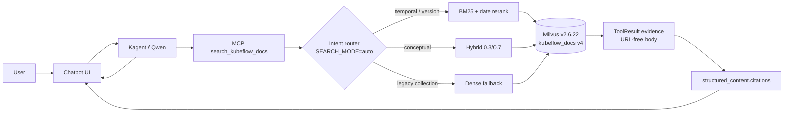

# RAG v4 Architecture

Production-oriented architecture for Kubeflow documentation retrieval: Milvus v2.6.22 hybrid search (dense + native BM25), deterministic intent routing, typed `release_date` metadata, and structured citations consumed by the chatbot UI.

**Related:** [docs/local-milvus-runbook.md](local-milvus-runbook.md), [MILVUS_INFRA_UPGRADE.md](../MILVUS_INFRA_UPGRADE.md)

---

## Why this data exists

The repository keeps a **file-over-chat** artifact trail under `artifacts/` so retrieval quality can be measured before trusting LLM answers. Raw hit bodies, LLM completions, and eval payloads live on disk—not in chat transcripts or agent stdout.

| Path | Purpose |
| --- | --- |
| `artifacts/local_hybrid_v4_embedded.jsonl` | Frozen chunks + 768-d dense vectors from the v4 parser/chunker |
| `artifacts/canonical_rag_v4_parser_baseline.jsonl` / `.md` | Parser/chunker snapshot for diffing (2267 records, 220 source files, parser/chunker **1.0.0**, **768-d**, **65** rows with `release_date`) |
| `tests/retrieval_golden.json` | Core eval set (~51 docs queries after skipping issues/code cases) |
| `artifacts/generated_retrieval_golden.json` | Release/date eval set (~96 LLM-paraphrased queries) |
| `artifacts/v4_core_eval_{dense,bm25,hybrid}.*` | Per-mode outcome reports on the core golden set |
| `artifacts/v4_release_eval_{dense,bm25,hybrid}.*` | Per-mode outcome reports on the release/date golden set |
| `artifacts/v4_router_comparison.json` | Auto-router vs single-mode comparison on core golden |

**Workflow:** parse/chunk → embed → index → run golden evals in each mode → compare → promote only when router + BM25 + `release_date` beat dense-only baselines.

---

## Old architecture problems

The prior production path used **dense-only** Milvus schema v2 against collection `kubeflow_docs`:

| Problem | Symptom |
| --- | --- |
| No BM25 / weak exact-version matching | Semver literals, config keys, and error strings missed by cosine similarity alone |
| No `release_date` field | “Latest release” answered from LLM memory (e.g. hallucinated **0.6.1** from 2019) instead of indexed release tables |
| URLs in LLM answers | Kagent printed Markdown links; the UI could not own citation rendering |
| Model-chosen retrieval strategy | Low-capability models picked wrong search modes when asked |
| Ad-hoc chunking/cleaning | Hugo shortcodes, nav pages, and release tables were inconsistently handled |

Evidence: `tests/retrieval_baseline_portforward_analysis.md` — core golden evidence hit@5 **28.6%** on dense-only cluster Milvus; recency/version queries were the dominant failure cluster.

---

## New architecture

### Query path



```text
User
  → Chatbot UI (frontend/docs_scripts/chatbot.js)
  → Kagent (Qwen2.5-7B) — tool-first prompt, no URLs in answers
  → MCP search_kubeflow_docs (docs-agent-mcp/mcp-server/server.py)
      → intent router (SEARCH_MODE=auto)
      → Milvus v2.6.22 hybrid collection (dense + native BM25)
      → ToolResult: URL-sanitized evidence + structured citations
  → UI Sources panel renders citations from structured_content
```

### Ingest path

```text
GitHub docs (kubeflow/website)
  → KFP kubeflow-pipeline.py
  → canonical_rag_ingest.py (Hugo parse, token-aware chunk, release_date extract)
  → TEI MPNet (768-d, sentence-transformers/all-mpnet-base-v2)
  → Milvus v4 schema (content_text BM25 input, vector, sparse_vector, release_date)
```

Implementation anchors: `docs-agent-mcp/pipelines/canonical_rag_ingest.py`, `docs-agent-mcp/pipelines/kubeflow-pipeline.py`, `docs-agent-mcp/mcp-server/server.py`.

---

## Milvus v4 schema (lean)

Collection: `kubeflow_docs` (production) or `kubeflow_docs_hybrid_v4_candidate` (local). Description marker: `v=4`.

| Field | Type | Purpose |
| --- | --- | --- |
| `id` | INT64 PK, auto | Milvus row id |
| `document_id` | VARCHAR(512) | Stable doc key (`repo:path`) |
| `content_text` | VARCHAR(2000), analyzer + match | Chunk text; BM25 input |
| `vector` | FLOAT_VECTOR(768) | Dense embedding (MPNet) |
| `sparse_vector` | SPARSE_FLOAT_VECTOR | Native BM25 output (`FunctionType.BM25`) |
| `chunk_index` | INT64 | Chunk ordinal within document |
| `citation_url` | VARCHAR(1024) | Public citation URL |
| `file_path` | VARCHAR(512) | Source path in repo |
| `title` | VARCHAR(256) | Page title |
| `section_path` | VARCHAR(512) | Heading breadcrumb |
| `doc_type` | VARCHAR(32) | `release`, `documentation`, `nav`, `redirect` |
| `version` | VARCHAR(32) | Kubeflow version when known |
| `release_date` | INT64, nullable | Unix epoch of product GA/release date |

**Not stored in Milvus rows** (JSONL/manifest only): `parser_version`, `chunker_version`, `heading_level`, `estimated_tokens`, `links`.

Indexes: `vector` FLAT COSINE; `sparse_vector` SPARSE_INVERTED_INDEX BM25.

---

## Intent router

Deterministic rules in MCP when `SEARCH_MODE=auto`. No LLM involvement. Legacy collections without `sparse_vector` downgrade to dense fallback.

| Intent | Triggers (examples) | Mode | Post-search |
| --- | --- | --- | --- |
| **temporal** | `latest`, `current`, `newest`, `most recent` | **bm25** | Filter `doc_type=release`; rerank by `release_date` DESC |
| **release_date** | `when was`, `release date`, `released` + version | **bm25** | Prefer matching `version` chunk |
| **lexical / exact** | Semver literals, config keys, error strings | **bm25** | — |
| **conceptual** | `how`, `why`, `explain`, `overview`, `architecture` | **hybrid** (0.3 dense / 0.7 sparse, depth 50) | Weighted ranker |
| **compare** | Two version tokens or “compare X and Y” | **hybrid** | Merge version evidence |
| **legacy collection** | Missing `sparse_vector` or v4 fields | **dense** | Capability downgrade |

Router provenance is returned in `structured_content.retrieval` (`retrieval_mode`, `intent`, `reason`).

---

## Citation contract

| Layer | Responsibility |
| --- | --- |
| **MCP** | `ToolResult.structured_content.citations` — list of `{id, url, score, section?, version?, release_date?, doc_type?, file_path?}` |
| **MCP evidence body** | URL-sanitized markdown (`_sanitize_evidence_text`); chunk text only, citation ids like `[c1]` |
| **Kagent / Qwen** | Must not print URLs, Markdown links, or source lists in answers |
| **Chatbot UI** | `chatbot.js` reads `structured_content.citations` and renders the Sources panel |

The LLM synthesizes answers from evidence blocks; the UI owns clickable citations.

---

## Evaluation findings

All metrics: **hit@5** on labeled golden sets. Source hit = correct page in top 5; evidence hit = labeled chunk text in top 5.

### Core golden (~51 queries)

| Mode | Source@5 | Evidence@5 |
| --- | ---: | ---: |
| dense | 66.7% | 33.3% |
| bm25 | 78.4% | 39.2% |
| hybrid (0.3/0.7, depth 50) | 78.4% | 41.2% |
| **auto-router** | **80.4%** | **51.0%** |

Source: `artifacts/v4_core_eval_*.json`, `artifacts/v4_router_comparison.json`.

From `v4_router_comparison.json`: router beats all single modes on evidence (**0.51** vs dense **0.33** / bm25 **0.39** / hybrid **0.41**). Router mode mix: **bm25 31**, **hybrid 20**.

### Release/date golden (~96 queries)

| Mode | Source@5 | Evidence@5 |
| --- | ---: | ---: |
| dense | 66.7% | 20.8% |
| bm25 | 75.0% | 47.9% |
| hybrid | 81.2% | 36.5% |
| **router** (release set) | **~75%** | **~50%** |

Source: `artifacts/v4_release_eval_*.json`, `artifacts/v4_router_eval_analysis.json`.

**Category insight** (router on release set):

| Category | Evidence@5 | Notes |
| --- | ---: | --- |
| historical-release | **96.7%** | Strong under BM25 + `release_date` rerank |
| versioned-component | **~30%** | Still weak; largest remaining gap |
| historical-dependency | 20.0% | Mixed |

Dense fails hard on date/recency queries (evidence **20.8%** vs BM25 **47.9%**).

### Infrastructure note

Milvus **8Gi** memory upgrade alone did **not** improve retrieval quality vs the 4Gi baseline (`tests/retrieval_baseline_portforward_analysis.md`, `tests/retrieval_candidate_8Gi_repeat3.json`). Latency improved; quality did not. Gains come from **BM25 + router + release_date**, not RAM.

### Prompt / citation discipline

Structured citations + no-URL Kagent prompt (`docs-agent-mcp/manifests/kagent/setup.yaml`) prevent the model from rendering source links. **Tool-first enforcement** for low-capability models remains necessary—small models may still skip MCP or answer from parametric memory without a successful tool call in the current turn.

---

## Remaining gaps

| Gap | Status |
| --- | --- |
| Chunk **2000** UTF-8 cap vs TEI **768** char embed truncation | Dense leg may miss tail of long chunks; BM25 indexes full 2000 |
| Explicit `SEARCH_MODE=bm25` bug | Does not reliably call `_bm25_search`; use `auto` or `hybrid` in production |
| Personal Docker Hub image tag in some deploy manifests | Should revert to GHCR/OCI registry for team deploys |
| versioned-component evidence weak (~30%) | Needs chunking or routing improvements for component semver pages |
| Incremental pipeline (`incremental-pipeline.py`) | Still legacy dense schema; full rebuild via `kubeflow-pipeline.py` is the v4 path |

---

## References

- [docs/local-milvus-runbook.md](local-milvus-runbook.md) — local Milvus docker compose
- [MILVUS_INFRA_UPGRADE.md](../MILVUS_INFRA_UPGRADE.md) — cluster Milvus operator upgrade
- Milvus BM25: https://milvus.io/docs/v2.6.x/full-text-search.md
- Milvus hybrid search: https://milvus.io/docs/v2.5.x/multi-vector-search.md
