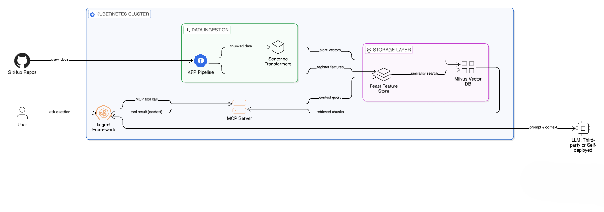

# kagent Setup for Kubeflow Docs Agent

Deploy the Kubeflow documentation assistant using kagent, MCP, Feast, and Milvus on Kubernetes.

## Architecture



## Prerequisites

- Kubernetes cluster with Helm 3.x
- `kubectl` access to a namespace (examples use `<YOUR_NAMESPACE>`)
- Python 3.9+
- A Groq API key (or other OpenAI-compatible LLM provider)
- Container registry (e.g. Docker Hub) to push the MCP server image

## Placeholders and how to fill them

- **`<YOUR_NAMESPACE>`**
  - Any Kubernetes namespace you control, for example:
    - Create it: `kubectl create namespace docs-agent`
    - Then use `docs-agent` as `<YOUR_NAMESPACE>`.
  - Used in:
    - `manifests/mcp-server/mcp-server.yaml` (`metadata.namespace`, Service namespace)
    - `manifests/kagent/setup.yaml` (all `metadata.namespace` fields and MCP URL)
    - Istio AuthorizationPolicies under `manifests/istio/`
    - All `kubectl` and `helm` commands in this README.

- **`<YOUR_DOCKERHUB_USERNAME>`**
  - Your Docker Hub (or other registry) account name.
  - Build and push the MCP image from `mcp-server/`:
    - `docker build -t <YOUR_DOCKERHUB_USERNAME>/mcp-kubeflow-docs:latest .`
    - `docker push <YOUR_DOCKERHUB_USERNAME>/mcp-kubeflow-docs:latest`
  - Used in:
    - `manifests/mcp-server/mcp-server.yaml` (`image: <YOUR_DOCKERHUB_USERNAME>/mcp-kubeflow-docs:latest`)

- **`<YOUR_GROQ_API_KEY>`**
  - Get it from the Groq console and paste it into:
    - `manifests/kagent/setup.yaml` → `stringData.GROQ_API_KEY`.
  - This Secret is referenced by the `ModelConfig` in the same file.

- **Feast / Milvus placeholders in `feast_repo/feature_store.yaml`**
  - The `feast_repo/` folder is a **legacy/example configuration** and is **not required** for the default pipeline flow. The pipeline code configures Feast and Milvus directly.
  - You can safely ignore or delete `feast_repo/` unless you explicitly want to experiment with a standalone Feast repo configuration.

## Deployment Guide

### Step 1: Install Milvus

```bash
helm repo add zilliztech https://zilliztech.github.io/milvus-helm/
helm repo update

helm upgrade --install milvus zilliztech/milvus -n <YOUR_NAMESPACE> \
  --set cluster.enabled=false \
  --set standalone.enabled=true \
  --set etcd.replicaCount=1 \
  --set etcd.persistence.enabled=false \
  --set minio.mode=standalone \
  --set minio.replicas=1 \
  --set pulsar.enabled=false \
  --set pulsarv3.enabled=false
```

Wait for all Milvus pods to be ready:

```bash
kubectl get pods -n <YOUR_NAMESPACE> -l app.kubernetes.io/instance=milvus
```

### Step 2: Apply Istio AuthorizationPolicies

Check if Milvus pods have Istio sidecars (`2/2` = sidecar present, `1/1` = no sidecar):

```bash
kubectl get pods -n <YOUR_NAMESPACE> -l app.kubernetes.io/instance=milvus
```

If pods show `2/2`, the cluster's `global-deny-all` policy blocks traffic by default. Apply the AuthorizationPolicies:

```bash
kubectl apply -f manifests/istio/
```

| Policy | Target | Ports | Purpose |
|--------|--------|-------|---------|
| `allow-milvus-standalone` | Milvus standalone | 19530, 9091 | App access to vector DB |
| `allow-milvus-etcd` | etcd | 2379, 2380 | Milvus metadata storage |
| `allow-milvus-minio` | MinIO | 9000, 9001 | Milvus object storage |

### Step 3: Test Milvus Connection

```bash
python -c "from pymilvus import connections; connections.connect('default', host='milvus.<YOUR_NAMESPACE>.svc.cluster.local', port='19530'); print('Connected!')"
```

### Step 4: Run the KFP Pipeline

Compile the pipeline:

```bash
cd pipelines
pip install kfp
python kubeflow-pipeline.py
```

Upload the generated `github_rag_pipeline.yaml` to the KFP dashboard and create a run. This pipeline is responsible for crawling GitHub docs, chunking, embedding, and registering features in Feast backed by Milvus, so you **do not need** the `feast_repo/` folder for the standard setup.

### Step 5: Build, Push, and Deploy MCP Server

From the `mcp-server/` directory, build and push the MCP image to your registry (Docker Hub example shown; adjust `<YOUR_DOCKERHUB_USERNAME>` and tags as needed):

```bash
cd mcp-server
docker build -t <YOUR_DOCKERHUB_USERNAME>/mcp-kubeflow-docs:latest .
docker push <YOUR_DOCKERHUB_USERNAME>/mcp-kubeflow-docs:latest
```

Ensure `manifests/mcp-server/mcp-server.yaml` is updated to use your pushed image (`image: <YOUR_DOCKERHUB_USERNAME>/mcp-kubeflow-docs:latest`), then deploy the MCP server:

```bash
kubectl apply -f manifests/mcp-server/mcp-server.yaml
```

Verify:

```bash
kubectl get pods -n <YOUR_NAMESPACE> -l app=mcp-kubeflow-docs
```

### Step 6: Install kagent (CRDs and Controller)

```bash
helm install kagent-crds oci://ghcr.io/kagent-dev/kagent/helm/kagent-crds --namespace <YOUR_NAMESPACE>

helm install kagent oci://ghcr.io/kagent-dev/kagent/helm/kagent \
  --namespace <YOUR_NAMESPACE> \
  --set agents.argo-rollouts-agent.enabled=false \
  --set agents.cilium-debug-agent.enabled=false \
  --set agents.cilium-manager-agent.enabled=false \
  --set agents.cilium-policy-agent.enabled=false \
  --set agents.helm-agent.enabled=false \
  --set agents.istio-agent.enabled=false \
  --set agents.k8s-agent.enabled=false \
  --set agents.kgateway-agent.enabled=false \
  --set agents.observability-agent.enabled=false \
  --set agents.promql-agent.enabled=false \
  --set tools.grafana-mcp.enabled=false \
  --set tools.querydoc.enabled=false
```

Before configuring kagent, make sure you have a valid LLM API key (for example, a Groq API key) and that you have set `<YOUR_GROQ_API_KEY>` in `manifests/kagent/setup.yaml` under `stringData.GROQ_API_KEY`.

Apply the custom agent configuration:

```bash
kubectl apply -f manifests/kagent/setup.yaml
```

Verify:

```bash
kubectl get pods -n <YOUR_NAMESPACE> | grep -E 'kagent|kubeflow-docs-agent'
kubectl get agents,remotemcpservers,modelconfigs -n <YOUR_NAMESPACE>
```

### Step 7: Access kagent UI

```bash
kubectl -n <YOUR_NAMESPACE> port-forward service/kagent-ui 8080:8080
```

Open http://localhost:8080 in your browser to interact with the Kubeflow docs agent.
## Troubleshooting

### RBAC: Access denied when connecting to Milvus

If you encounter permission or connection errors when the MCP server tries to connect to Milvus, use port-forwarding to isolate the issue:

```bash
kubectl port-forward -n <YOUR_NAMESPACE> deployment/milvus-standalone 19530:19530 &
python -c "from pymilvus import connections; connections.connect('default', host='localhost', port='19530'); print('Connected')"
kill %1
```

- If **port-forward works but direct cluster access fails**, Istio is likely blocking traffic. Apply the Istio configuration:

```bash
kubectl apply -f ../manifests/istio/
```

---

### Default bundled Kagent agents crash with `CreateContainerConfigError`

**Symptom**

After installing Kagent, several bundled agents (e.g. `argo-rollouts-conversion-agent`, `cilium-debug-agent`, `k8s-agent`, etc.) may enter a `CreateContainerConfigError` state. You may also observe elevated memory usage (~2GB+) while the intended `kubeflow-docs-agent` pod fails to schedule.

**Cause**

If Kagent is installed without the `--set agents.*.enabled=false` flags described in Step 6 of this README, the default bundled agents are deployed automatically.

These agents expect a `kagent-openai` secret, which is not created as part of this project’s setup. As a result, they crash loop due to missing configuration.

**Resolution**

Reinstall Kagent using the flags provided in Step 6 to disable the bundled agents.

**Cleanup (if already installed)**

If Kagent was already installed without the flags, delete the default agents manually:

```bash
kubectl delete agent argo-rollouts-conversion-agent \
  cilium-debug-agent \
  cilium-manager-agent \
  cilium-policy-agent \
  helm-agent \
  istio-agent \
  k8s-agent \
  kgateway-agent \
  observability-agent \
  promql-agent \
  -n <YOUR_NAMESPACE>
```

---

### Debug Commands

Use the following commands to inspect system state and logs:

```bash
kubectl get pods -n <YOUR_NAMESPACE> | grep milvus
kubectl logs -f deployment/mcp-kubeflow-docs -n <YOUR_NAMESPACE>
kubectl logs -f deployment/kubeflow-docs-agent -n <YOUR_NAMESPACE>
kubectl get agents,remotemcpservers,modelconfigs -n <YOUR_NAMESPACE>
```

---

### Cleanup

To completely remove all deployed components:

```bash
helm uninstall kagent -n <YOUR_NAMESPACE>
kubectl delete agent,remotemcpserver,modelconfig --all -n <YOUR_NAMESPACE>
helm uninstall milvus -n <YOUR_NAMESPACE>
kubectl delete pvc -n <YOUR_NAMESPACE> -l app.kubernetes.io/instance=milvus
kubectl delete -f manifests/mcp-server/mcp-server.yaml
kubectl delete -f manifests/istio/
```